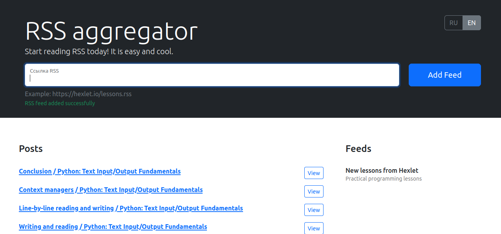

# [RSS aggregator](https://frontend-project-11-five-sooty.vercel.app/)

### Hexlet tests and linter status:

### Description

Basic RSS Feed Aggregator - you can add feeds to the page and watch all posts.

When a new posts would be added to the feeds, they will be rendered on the page automatically.

To be able to start the application locally, you need Node.js and npm installed.

Solution is using Webpack to deploy the application.

### Instructions

#### install npm dependencies 
`make install`

#### linter the code
`make lint`

#### run the application locally
`make debug`

#### deploy the application (in dist folder)
`make build`

### Preview

[Demo Page](https://frontend-project-11-five-sooty.vercel.app/)

